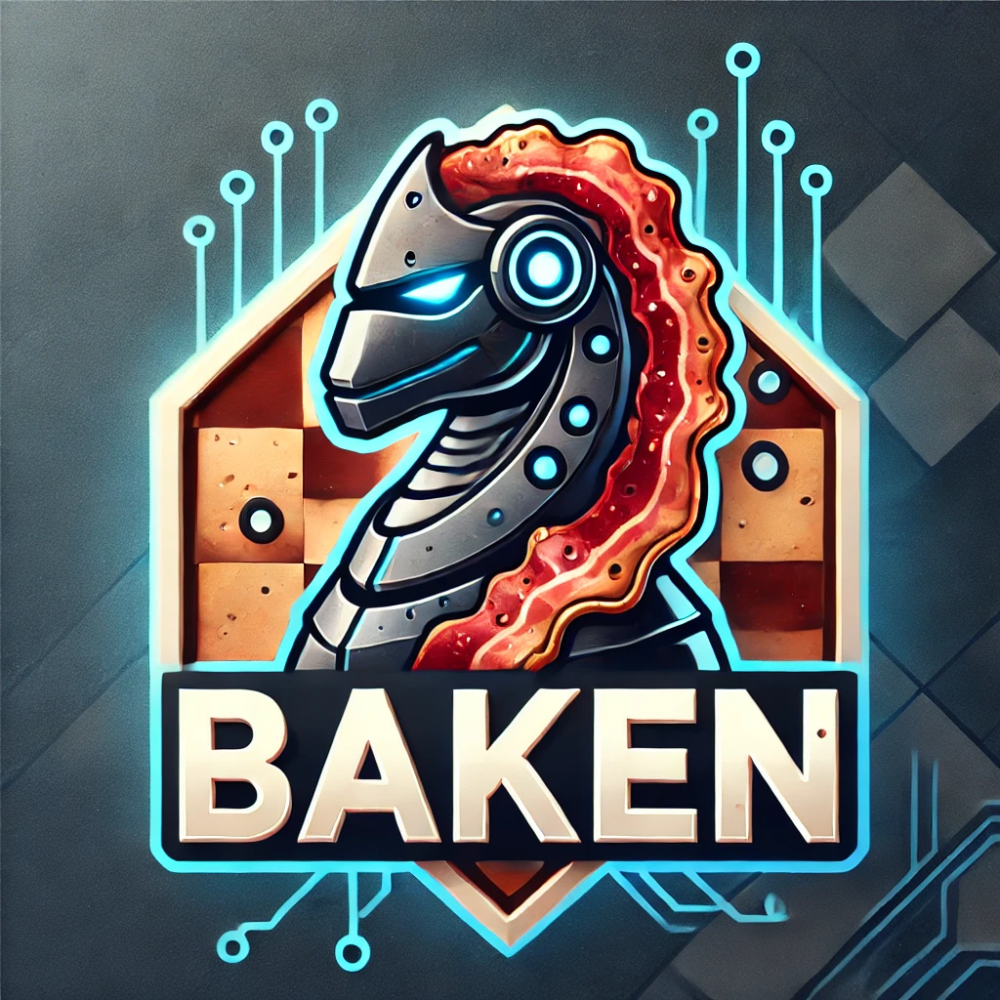

<p align="center">
  
</p>

<h1 align="center">♞ ChessBAKEN 🥓</h1>

<p align="center">
  A Python-powered chess engine inspired by AlphaGo
  <br />
</p>

#### 

## 📌 About

ChessBAKEN is a chess engine built in Python. It is compatible with UCI GUIs and uses `python-chess` for move validation and game logic. 

## ✨ Features

🕸️ Neural net powered move selector and position evaluator  

✅ UCI compatible

♟️ Plays legal chess moves  

## 🚀 Dependencies
```sh
pip install torch torchvision torchaudio --index-url https://download.pytorch.org/whl/cpu
pip install python-chess
pip install numpy
pip install PyInstaller
```

## 💻 Installation 
```sh
git clone https://github.com/averyrair/ChessBAKEN
cd ChessBAKEN
python -m PyInstaller --onefile BAKEN.py
cp dist/BAKEN .
```
Import BAKEN binary as an engine in a UCI compatible GUI or run from the command line! 😀
```sh
./BAKEN
```

## ♛ Recommended UCI GUI
[Arena Chess](http://www.playwitharena.de/downloads/arena_3.5.1.zip)
